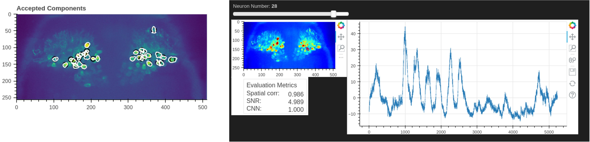

# lab_analysis

本レポジトリーは、in vivoカルシウムイメージングデータを対象とした、
1細胞レベル神経活動解析の実装例をまとめたポートフォリオです。  
（研究守秘義務に基づき、許可されたコードおよび再構成した解析例のみ公開）

本リポジトリでは、実験データの前処理（動き補正）から  
細胞抽出（CaImAn）、刺激応答の時系列解析、統計評価、空間mappingまで、  
一連の解析パイプラインをPythonで一貫して実装しています。

## 主な特徴
・in vivo神経活動データの1細胞レベル解析  
・前処理〜抽出〜統計までの再現性を意識した解析設計  
・実験データ特性を踏まえた解析フローの統合実装  

(各内容の詳細は、各フォルダのreadmeをご確認ください)

## 内容
### caiman_analysis  
CaImAnを用いたカルシウムイメージング解析例  
（動き補正、細胞抽出、ΔF/F算出、時系列信号解析）

  

  動き補正・自動細胞抽出・神経活動記録解析のpipeline構築に成功した

### odor_response_mapping  
匂い刺激応答における小脳プルキンエ細胞の時空間応答マッピング  
（刺激依存的ROI応答の時系列解析＋空間heatmap）

  

  匂い刺激に対する時空間応答マッピングを作成し、応答領域の同定に成功した

### cluster_visualization  
Open CVを用いた、小脳プルキンエ細胞活動のクラスタリング解析例  
（時空間解析とクラスター解析の統合）

  

  Open CVを用いたクラスタリング解析により、時空間活動パターンの可視化およびクラスタ構造の抽出を実現した

## 主な使用技術
Python / CaImAn / NumPy / pandas / matplotlib / OpenCV
1細胞神経活動データに対する前処理〜抽出〜統計解析までの一連の解析フローを実装
