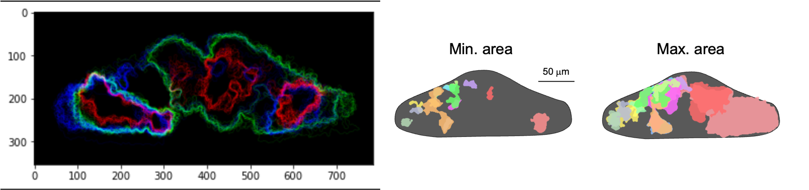

# cluster_visualization (OpenCV)

in vivoカルシウムイメージング解析で得られた  
1細胞レベル神経活動データに対して、  
クラスタリング結果を空間的に可視化するための解析コードです。

本コードでは、実験画像上のROI座標情報と  
活動クラスタリング結果を統合し、  
細胞活動の空間分布を直感的に把握できる可視化処理を実装しています。

---

## 解析フロー
・神経活動クラスタの空間配置の可視化  
・刺激応答細胞の分布評価  
・画像ベースの定量解析補助  

---

## 解析結果例

  

---

## 使用技術
- Python  
- OpenCV（画像描画・座標マッピング）
- NumPy / pandas  
- matplotlib  

特にOpenCVを用いて、
実験画像上にROI位置とクラスタ情報を重ねて描画し、  
神経活動の時空間的特徴を可視化しています。

---

## 実装内容
- ROI座標データの読み込み
- クラスタ情報との統合
- OpenCVによる画像上へのプロット描画
- クラスタ別色分け可視化
- 空間分布のヒートマップ的表示

---

## 研究との関連
本コードは、自身の研究で取得したin vivoカルシウムイメージングデータの解析結果を、
空間的に解釈するために開発した可視化モジュールです。

1細胞レベルで抽出した神経活動データ（ROI）とクラスタリング結果を統合し、
実験画像上に直接マッピングすることで、
刺激応答細胞の空間分布および活動パターンの構造的特徴を評価できるようにしました。 

従来の時系列解析のみでは把握が困難であった
「どの領域の細胞群が類似した活動を示すか」という
空間的な神経活動の偏在性を直感的に可視化することを目的として実装しています。  

また、論文用図および解析結果の検証過程において、
ROI位置・クラスタ情報・実験画像を統合した再現性の高い可視化パイプラインとして
実際の研究解析フローの一部として使用しています。
