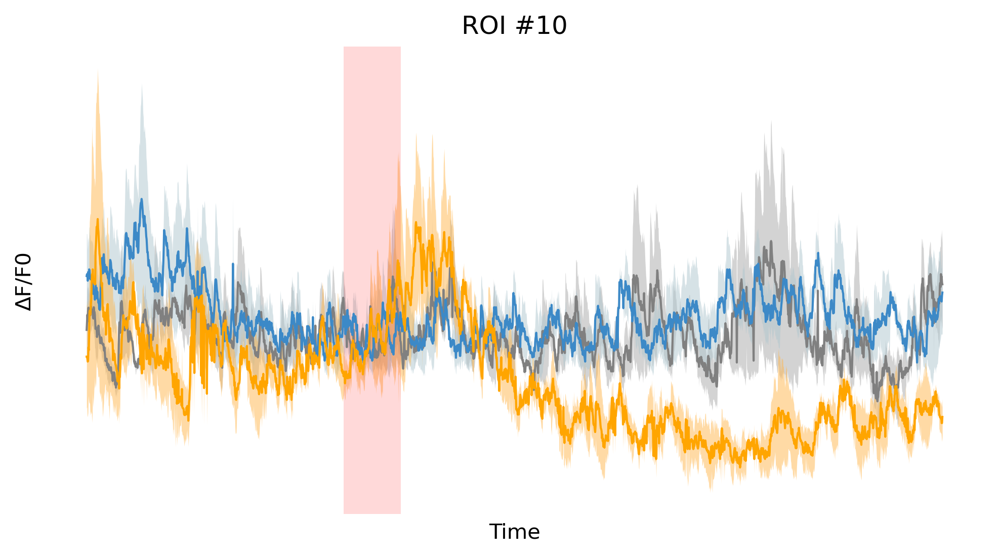
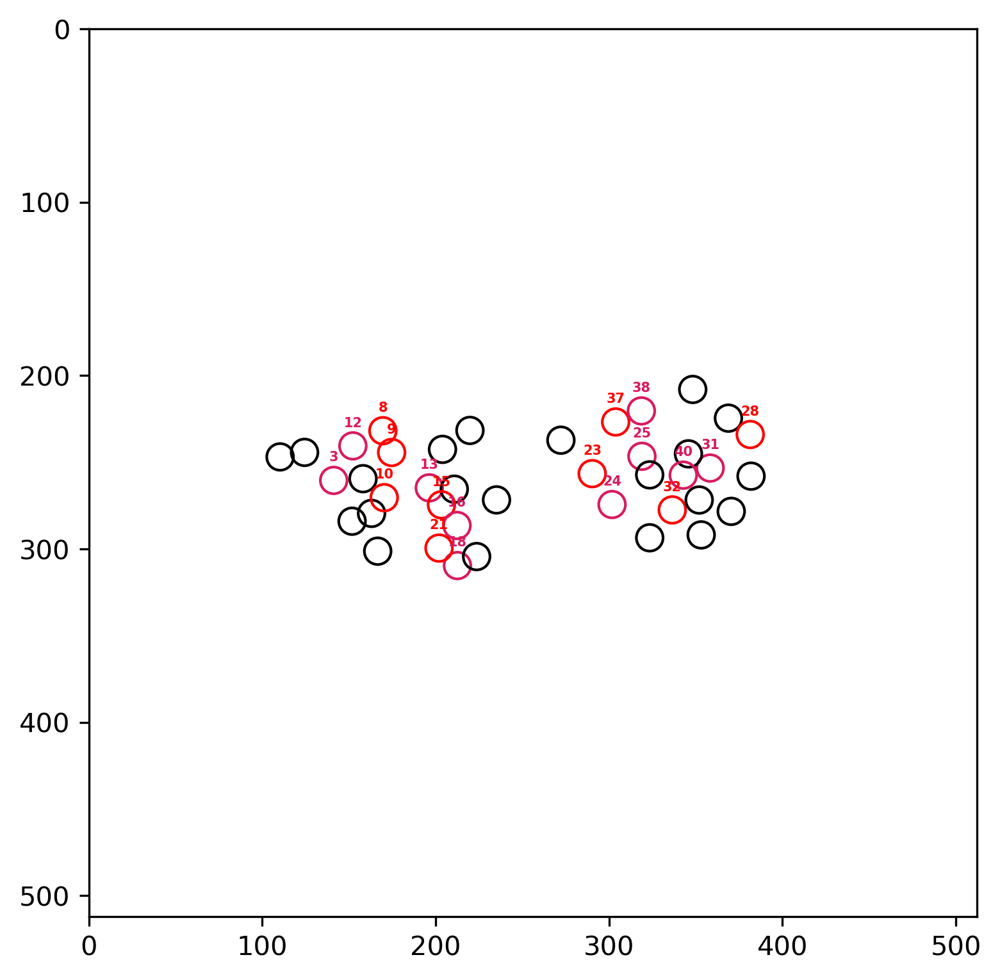

# Odor_response Analysis

in vivoカルシウムイメージングデータに対して、
前処理から細胞応答の定量評価、空間mappingまでを一貫して行った解析例です。

---

## 解析フロー
- ΔF/F算出（前処理・正規化）
- 刺激応答の時系列解析
- Glass’s Δを用いた刺激特異的細胞応答の定量評価
- 応答細胞の空間mapping（heatmap）

---

## 解析結果例

### 1細胞における刺激応答の時系列解析例

  

### 刺激応答の空間mapping（heatmap型）

  

### 刺激応答の空間mapping（閾値型）

  

---

## 使用技術

---

## 実装内容

---

## 研究との関連

---
